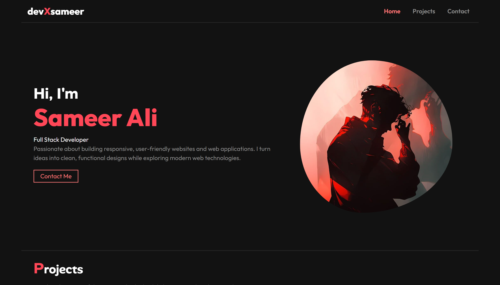
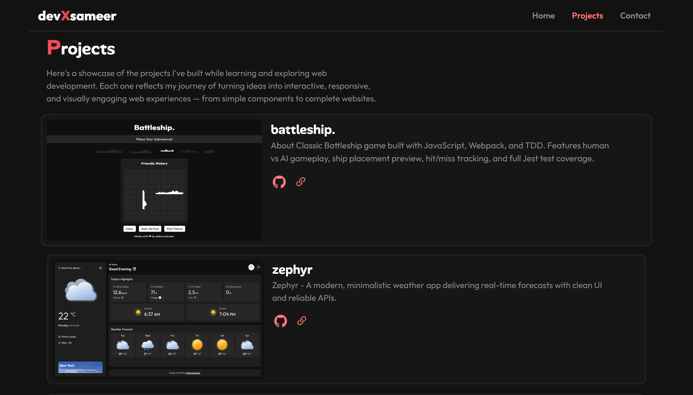
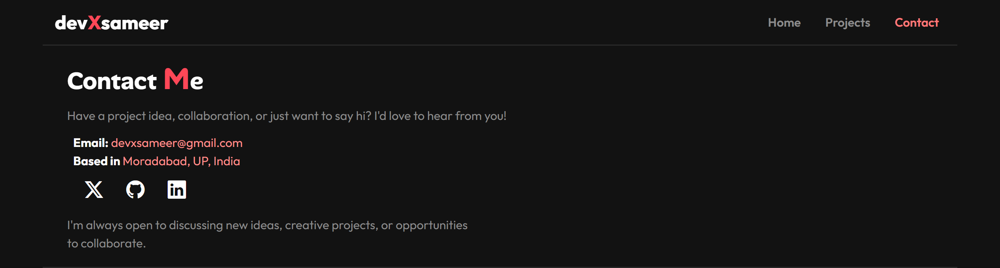

# 🏠 Personal Homepage – devXsameer

A modern, responsive **developer portfolio homepage** built from scratch as part of [The Odin Project](https://www.theodinproject.com/) curriculum.  
While the provided design was minimal, I decided to create my **own unique and professional layout** — blending accessibility, responsiveness, and dark-themed aesthetics.

---

## 🌐 Live Demo

[`View Portfolio Homepage`](https://devxsameer.github.io/homepage/)

## ✨ Overview

This project serves as the **homepage** for my developer portfolio — introducing myself, showcasing my projects, and providing ways to connect.  
It’s designed to be lightweight, visually appealing, and fully responsive across devices.

---

## 🎨 Features

- ⚡ **Custom Loader Animation** with a ripple transition
- 📱 **Responsive Design** (desktop, tablet, mobile)
- 🎯 **Scroll Spy Navigation** that highlights the active section
- 🍔 **Animated Hamburger Menu** for mobile navigation
- 🧠 **Smooth Scroll** with header offset
- 🌙 **Dark Mode Aesthetic** with soft shadows and accent color
- ♿ **Accessibility Focused** – semantic HTML, keyboard-friendly navigation
- 🔗 **Project Cards** linking to live demos and GitHub repos
- 📬 **Contact Section** with social links and email

---

## 🧱 Sections

### 🏠 Hero

Introduces me as a full-stack developer with a short description and a call-to-action button.



### 💼 Projects

A showcase of selected projects built while learning through The Odin Project:

- **Battleship** – Classic Battleship game with JS, Webpack, and TDD.
- **Zephyr** – Modern weather app using APIs and clean UI.
- **CrispTasks** – Modular to-do app with ES6 and Webpack.
- **LibraryX** – Minimal JS book library app with localStorage support.



### 📞 Contact

Direct links to my **email**, **GitHub**, **LinkedIn**, and **X (Twitter)** accounts, with a personal note about collaboration.

## 

## 🧩 Technologies Used

- **HTML5** – Semantic structure
- **CSS3** – Flex-box, custom properties, responsive design
- **JavaScript (ES6)** – Scroll spy, navigation, animations
- **Bootstrap Icons** – For minimalist icons
- **Custom Fonts** – Outfit & Alan Sans

---

## ⚙️ Functionality Highlights

### 🔁 Loader Animation

Uses CSS animations with ripple and opacity transitions to create a smooth page entry effect.

### 📜 Scroll Spy

Automatically updates the active link in the navigation bar based on the current scroll position.

### 📱 Responsive Navbar

A hamburger menu appears on smaller screens, expanding with a circular ripple animation.

---

## 🧠 Learning Takeaways

- Improved understanding of **scroll-based event handling**
- Enhanced **CSS architecture and variable management**
- Created reusable and accessible UI components
- Learned to structure and optimize **responsive layouts**
- Strengthened **JavaScript DOM manipulation** for interactive UI

---

## 🚀 How to Run

1. Clone this repository:
   ```bash
   git clone https://github.com/devxsameer/homepage.git
   cd homepage
   ```
1. Open the index.html file in your browser

## 📚 Credits

- Inspired by The Odin Project's HTML & CSS Responsive Design module

- Designed and developed entirely by `Sameer Ali`
